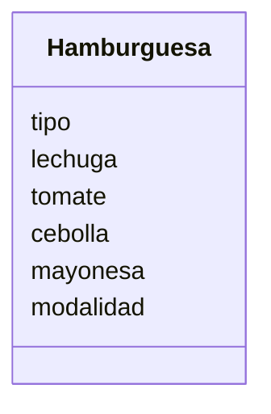

# Análisis

## Requisitos:

Ofrecer hamburguesas de res, pollo o vegetariana
Agregar extras: lechuga, tomate, cebolla y mayonesa
Decidir si comer en el restaurante o llevar el pedido

## Objetos: 

Hamburguesa

## Características:

- Hamburguesa:
    - tipo
    - lechuga
    - tomate
    - cebolla
    - mayonesa
    - modalidad

## Acciones:
(No hay acciones específicas)

# Diseño (requisito para hacer el diagrama)

Clases:
- Hamburguesa:
    - Nombre: Hamburguesa
    - Atributos:
        - tipo
        - lechuga
        - tomate
        - cebolla
        - mayonesa
        - modalidad
    - Métodos:
        - (No hay métodos)

