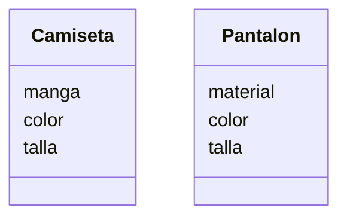

# Análisis

## Requisitos:

Ofrecer camisetas de manga corta o larga
Ofrecer pantalones de mezclilla o tela
Camisetas en colores: rojo, azul o verde
Pantalones en colores: negro, gris o blanco
Camisetas con tallas: S, M, L, XL
Pantalones con tallas: 32 hasta 44

## Objetos:

- Camiseta
- Pantalon

## Características:

- Camiseta:
    - manga
    - color
    - talla

- Pantalon:
    - material
    - color
    - talla

## Acciones:
(No hay acciones específicas)

# Diseño:

Clases:
- Camiseta:
    - Nombre: Camiseta
    - Atributos:
        - manga
        - color
        - talla

    - Métodos:
        - (No hay métodos)

- Pantalon:
    - Nombre: Pantalon
    - Atributos:
        - material
        - color
        - talla
    - Métodos:
        - (No hay métodos)

