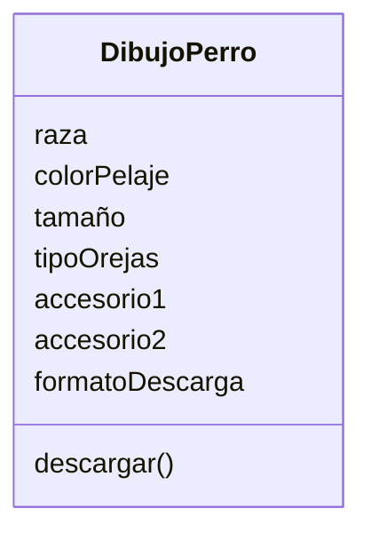

# Análisis

## Requisitos:

Seleccionar raza del perro (labrador, pastor alemán, etc.)
Seleccionar color del pelaje
Seleccionar tamaño del perro
Seleccionar tipo de orejas
Agregar hasta dos accesorios (sombreros, gafas)
Descargar dibujo en formato PNG o JPG

## Objetos:

DibujoPerro

## Características:

- DibujoPerro:
    - raza
    - colorPelaje
    - tamaño
    - tipoOrejas
    - accesorio1
    - accesorio2
    - formatoDescarga

## Acciones:

descargar dibujo

# Diseño:

Clases:
- DibujoPerro:
    - Nombre: DibujoPerro
    - Atributos:
        - raza
        - colorPelaje
        - tamaño
        - tipoOrejas
        - accesorio1
        - accesorio2
        - formatoDescarga
    - Métodos:
        - descargar()

