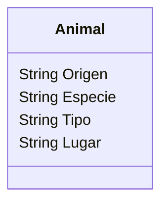

# Zoológico

Un zoológico quiere llevar un registro de los animales que llegan a sus instalaciones.
Necesitan registrar su especie, tipo y lugar donde fueron encontrados.
Los animales pueden ser mamíferos, reptiles o aves.
El origen de todos los animales es "feral".

## Análisis

### Requisitos:

- Registrar animales.
- Registrar los atributos de cada animal.
- Distinguir entre mamíferos, reptiles y aves.
- Mantener el mismo origen para todos ("feral").

### Objetos:

Animal

### Características:

- Animal
    - Origen
    - Especie
    - Tipo
    - Lugar

### Acciones:

(No hay acciones)

## Diagrama

