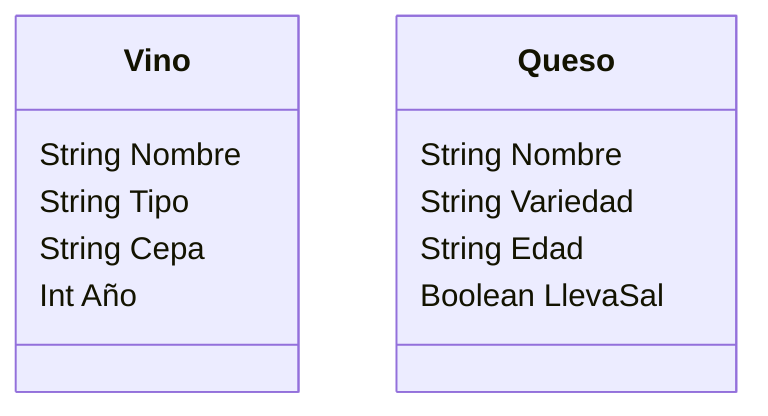

# Vinoteca

Una vinoteca quiere registrar los vinos y quesos que ofrecen.
De cada vino se necesita registrar su nombre, tipo, cepa y año de producción.
De cada queso se necesita registrar su nombre, variedad, edad y si lleva sal.
La vinoteca tiene en su inventario 4 vinos y 3 quesos.

## Análisis

### Requisitos:

- Registrar los vinos con sus atributos.
- Registrar los quesos con sus atributos.
- Mantener el inventario de productos diferenciados por tipo.

### Objetos:

- Vino
- Queso

### Características:

Vino
    - Nombre
    - Tipo
    - Cepa
    - Año

Queso
    - Nombre
    - Variedad
    - Edad
    - Lleva sal

Acciones:

(No hay acciones)

## Diseño

