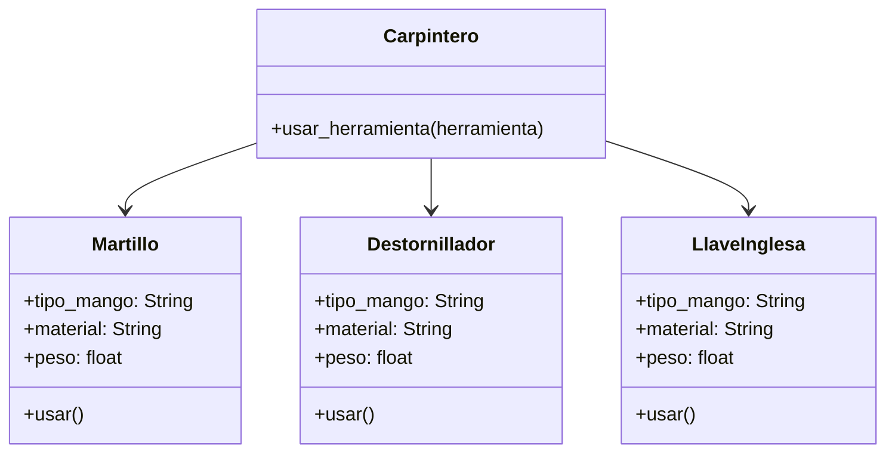

### Análisis

Requisitos

- Existen herramientas utilizadas por un carpintero  
- Cada herramienta debe ejecutar la acción `usar()`
- El carpintero no necesita conocer el tipo de herramienta (duck typing)
- Cada herramienta realiza una acción distinta:
    - Martillo: clavar clavos
    - Destornillador: ajustar tornillos
    - Llave inglesa: apretar tuercas
        
- Las herramientas tienen atributos como tipo de mango, material y peso
    

Objetos

- Herramientas
    

Características

- Herramienta (concepto base aunque no se programará clase padre estricta)
    - tipo_mango: String
    - material: String
    - peso: float
        

Acciones

- usar(): comportamiento diferente según la herramienta
- Carpintero usa herramientas usando polimorfismo  
    (no pregunta tipo, solo llama `usar()`)

### Diseño

