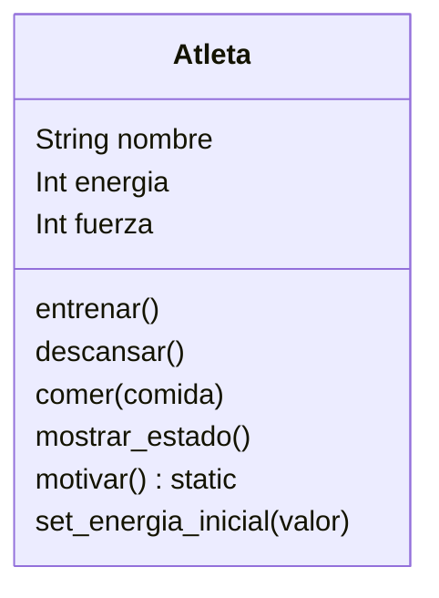

Análisis

Requisitos:

- Registrar nombre, energía y fuerza del atleta.
- Implementar métodos que permitan modificar su estado:
        entrenar(): aumenta fuerza y disminuye energía.
        descansar(): aumenta energía.
        comer(): solo hamburguesas → aumenta energía.

Objeto:

- Atleta

Características (atributos):

- Nombre
- Energía
- Fuerza

Acciones (métodos):

- Entrenar
- Descansar
- Comer

Diseño

