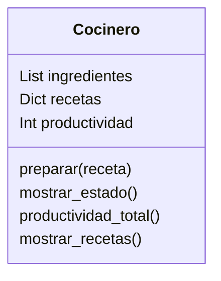

Análisis

Requisitos:

Modelar cocineros con sus ingredientes, recetas y productividad.

Un cocinero solo puede preparar una receta si tiene todos los ingredientes necesarios.

Cada receta preparada con éxito aumenta la productividad individual.

Calcular la productividad total de todos los cocineros.

Objetos:

Cocinero

Características:

Ingredientes disponibles (lista)

Recetas (diccionario o conjunto)

Productividad (entero)

Acciones:

Preparar receta

Mostrar estado

Calcular productividad total

