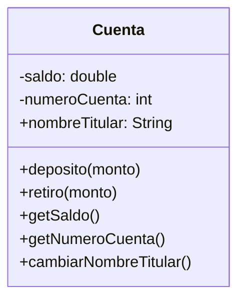

# Análisis

## Requisitos:

- Gestionar cuentas bancarias
- Cada cuenta tiene saldo, número de cuenta, nombre del titular
- El saldo se modifica a través de deposito o retiro.

## Objetos
- Cuenta

## Caraterísticas
- Cuenta
    - saldo
    - número de cuenta
    - nombre del titular
## Acciones
- Cuenta
    - deposito(monto)
    - retiro(monto)
    - getSaldo()
    - getNumeroCuenta()
    - cambiarNombreTitular()

## Diseño

