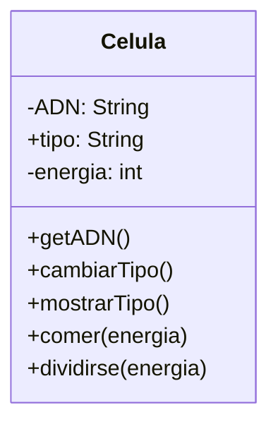

# Análisis

## Requisitos

- Una célula tiene ADN, tipo, energía
- La energía de la célula puede cormese o dividirse.

## Objetos
- Célula

## Caracterísiticas
- Célula
    - ADN
    - Tipo 
    - Energía

## Acciones
- Célula
    - comer(energía)
    - dividirse(energía)

# Diagrama

