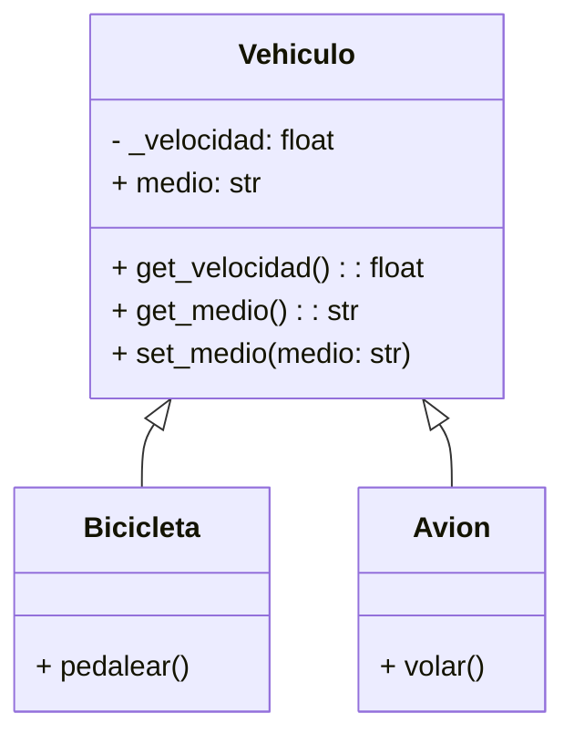

# Simulación de Vehículos

## Análisis

### Requisitos

La empresa de transporte necesita modelar distintos tipos de vehículos (bicicletas y aviones) que comparten ciertas características y comportamientos comunes.  
Para ello se utilizará herencia para evitar duplicar código.

### Objetos
- Vehiculo

### Características
- Vehículo
  - _velocidad (protegido)
  - medio (público) (terrestre, acuático, aéreo).

### Acciones
  - get_velocidad()
  - set_medio(medio)
  - get_medio()

### Objetos derivados
- Bicicleta (hereda de Vehiculo)
- Avión (hereda de Vehiculo)

#### Acciones
  - pedalear() (Bicicleta)
  - volar() (Avión)

## Diagrama

