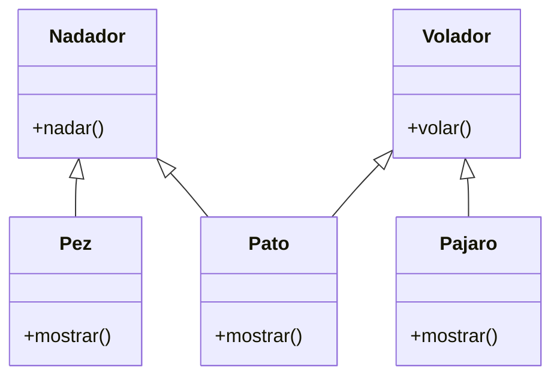

# Personajes con habilidades

## Análisis

### Requisitos

Se desea modelar un videojuego de aventura donde los personajes poseen distintas habilidades (nadar y/o volar).  
Algunos personajes pueden tener una sola habilidad, mientras que otros combinan varias.

### Objetos
- Nadador
- Volador

### Acciones
- nadador
    - nadar()
- volar
    - volar()

### Objetos derivados
- Pez: hereda de Nadador
- Pajaro: hereda de Volador.  
- Pato: hereda de Nadador y Volador.  

#### Acciones
- Pez
    - nadar(): hereda
    - mostrar()
- Pajaro
    - volar(): hereda
    - mostrar()
- Pato
    - nadar(): hereda
    - volar(): hereda
    - mostrar()

## Diagrama

