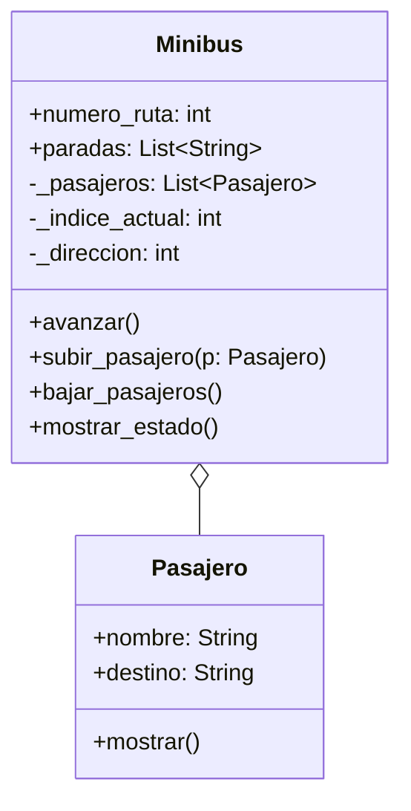

# Análisis

## Requisitos:

Un minibús tiene:
Un número de ruta (identificador).
Una lista de paradas programadas (por ejemplo: ["Arce", "Prado", "Perez"]).
Una lista de pasajeros a bordo.
Un índice de parada actual que indica dónde está el minibus.
Un sentido del recorrido (ida o vuelta).

Un pasajero tiene:
Un nombre.
Una parada de destino.
Condiciones:
Un pasajero solo puede subir si su destino está dentro del recorrido del minibus.
Un pasajero solo puede bajar si la parada actual coincide con su destino.
Las paradas son circulares: al llegar al final, el minibus invierte su lista y regresa.

## Objetos:

- Minibus
- Pasajero

## Características:

- Minibus:
  - numero_ruta: int
  - paradas: lista[str]
  - _pasajeros: lista[Pasajero]
  - _indice_actual: int
  - _direccion: int (1 = ida, -1 = vuelta)

- Pasajero:
  - nombre: string
  - destino: string

## Acciones:
  
- Minibus:
  - avanzar()
  - subir_pasajero(pasajero)
  - bajar_pasajeros()
  - mostrar_estado()

- Pasajero:
  - mostrar()

