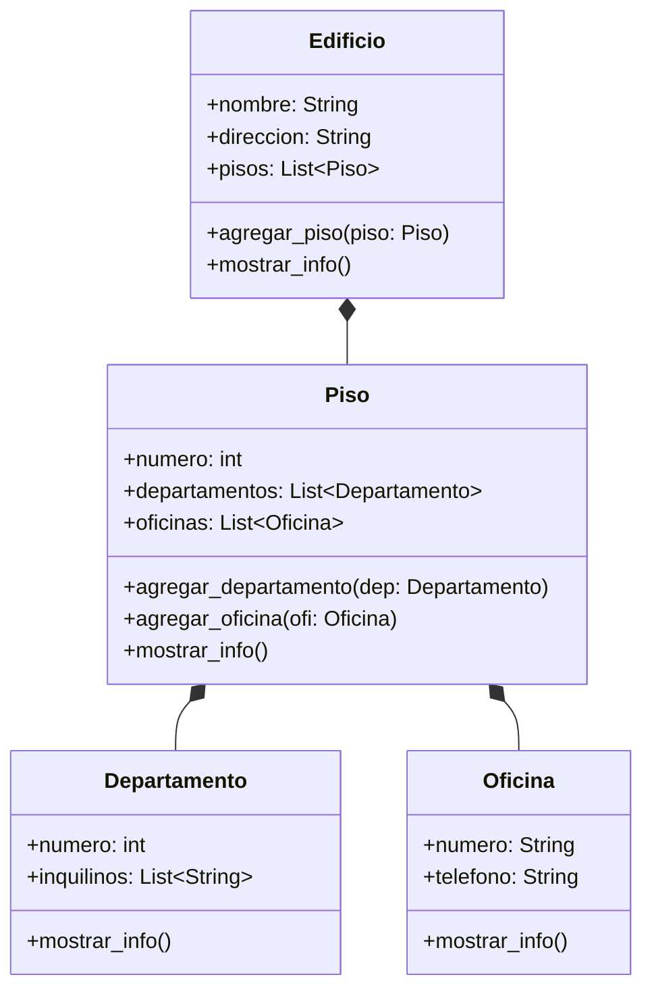

# Análisis

## Requisitos:

El sistema debe representar un edificio ubicado en La Paz, con 3 pisos.
Cada piso contiene departamentos y oficinas.
Los números de departamentos comienzan con el número del piso seguido de un número de unidad (ejemplo: 201, 304).
Las oficinas se identifican con el número del piso seguido de una letra (ejemplo: 2A, 3C).
El edificio tiene:
nombre
dirección
lista de pisos
Los pisos tienen:
número de piso
listas de departamentos y oficinas
Las oficinas tienen:
número de oficina
teléfono
Los departamentos tienen:
número de departamento
lista de inquilinos

## Objetos:

- Edificio
- Piso
- Departamento
- Oficina

## Características:

- Edificio:
  - nombre: string
  - direccion: string
  - pisos: lista[Piso]

- Piso:
  - numero: int
  - departamentos: lista[Departamento]
  - oficinas: lista[Oficina]

- Departamento:
  - numero: int
  - inquilinos: lista[str]

- Oficina:
  - numero: string
  - telefono: string

## Acciones:

- Edificio:
  - agregar_piso(piso)
  - mostrar_info() → muestra la jerarquía completa del edificio.

- Piso:
  - agregar_departamento(departamento)
  - agregar_oficina(oficina)
  - mostrar_info()

- Departamento:
  - mostrar_info()

- Oficina:
  - mostrar_info()

