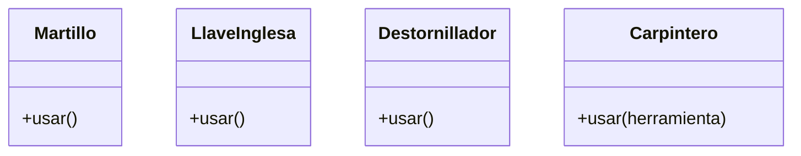

## Análisis

### Requisitos
- El carpintero puede usar diferentes herramientas.
- Cada herramienta tiene una función distinta.
- Martillo clava clavos.
- Llave inglesa aprieta tuercas.
- Destornillador ajusta tornillos.
- El carpintero puede usar cualquier herramienta sin importar su tipo (duck typing).

### Objetos
- Carpintero
- Martillo
- Llave Inglesa
- Destornillador
    
### Características

- Herramientas: nombre 
- Carpintero: herramienta

### Acciones

- Martillo: clavar()
- Llave Inglesa: apretar()
- Destornillador: ajustar()
- Carpintero: usar(herramienta)

## Diseño

