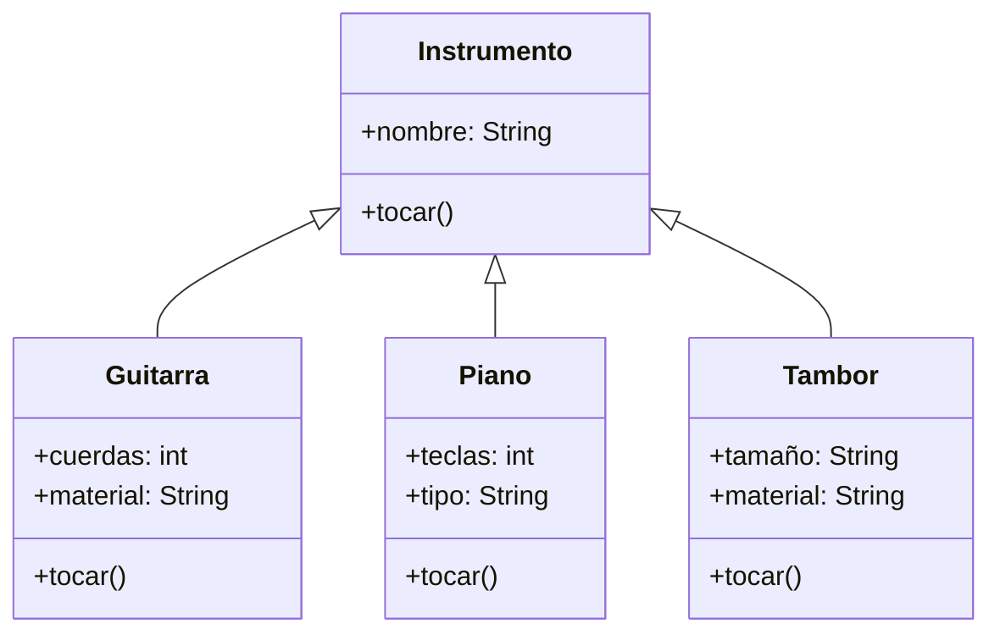

# Análisis

Requisitos
- Existen instrumentos musicales diferentes
- Cada instrumento puede ejecutar la acción `tocar()`
- Aunque suenen distinto, comparten una acción común
- La clase base Instrumento define el método `tocar()`
- Clases derivadas:
    - Guitarra → sonido “strum”
    - Piano → sonido “plin”
    - Tambor → sonido “boom”
        
- Los instrumentos poseen atributos relevantes:
    - Guitarra: cuerdas, material
    - Piano: teclas, tipo
    - Tambor: tamaño, material
        

Objetos
- Instrumento
- Guitarra
- Piano
- Tambor

Características
- Instrumento:
    - nombre: String
        
- Guitarra:
    - cuerdas: int
    - material: String
        
- Piano:
    - teclas: int
    - tipo: String
        
- Tambor:
    - tamaño: String
    - material: String
        

Acciones
- Instrumento: tocar()
- Guitarra: tocar() → strum
- Piano: tocar() → plin
- Tambor: tocar() → boom

# Diseño

