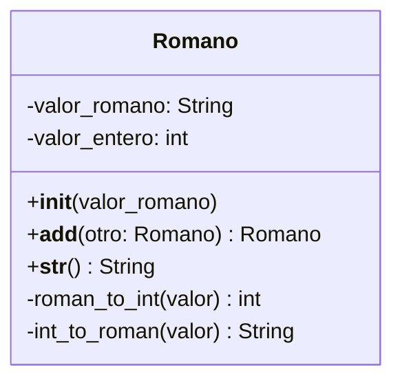

# Análisis

Requisitos
- Representar números romanos como objetos
- La clase debe convertir de romano a entero y viceversa
- Se debe poder sumar dos objetos Romano usando `+`
- El resultado debe ser un nuevo objeto Romano
- Ejemplo:
    - "X" + "V" = "XV"      

Objetos
- Romano

Características
- valor_romano: String
- valor_entero: int
    
Acciones
- convertir_romano_a_entero()
- convertir_entero_a_romano()
- sobrecargar operador `+` → `__add__`
- mostrar valor romano (método `__str__`)

# Diseño

