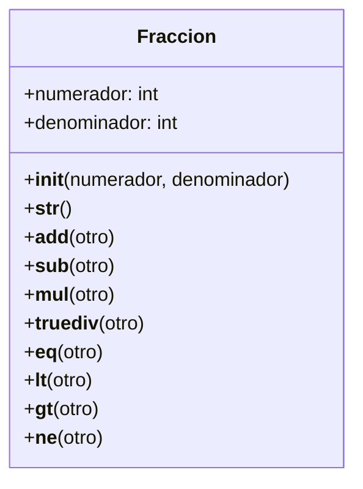

# Profe de mate

Un profesor de matemáticas necesita una calculadora de fracciones para enseñar conceptos básicos de aritmética. Cada fracción se representa mediante un numerador y un denominador.
Por ejemplo, la fracción 3/4 tiene un numerador igual a 3 y un denominador igual a 4.

## Análisis

### Requisitos

- Crear una calculadora de fracciones.
- La fracción tiene numerador y denominador (enteros).
- Debemos usar dunder methods.
- Esta calculadora puede sumar, restar, multiplicar y dividir fracciones.
- La clase Fracción también puede hacer operaciones de igualdad, menor que, mayor que o desigualdad de fracciones.

### Objetos

- Fraccion

### Características

- Fraccion: numerador, denominador

### Acciones

- Fraccion: inicializar
- Fraccion: representación en cadena
- Fraccion: operaciones aritméticas (suma, resta, multiplicación, división)
- Fraccion: comparaciones (igualdad, menor que, mayorque, desigualdad)

## Diagrama de Clases

