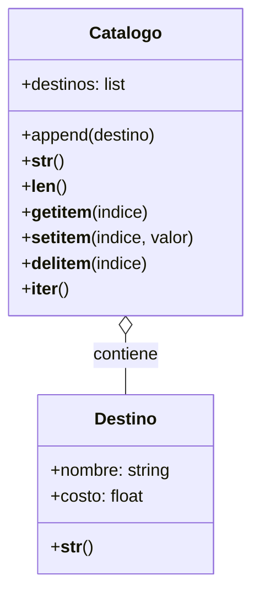

# Agencia de Viajes

La agencia de viajes necesita un sistema para gestionar sus destinos turísticos. Cada destino posee un nombre y un costo. El catálogo debe actuar como una colección que permite gestionar estos destinos mediante operaciones estándar de listas (ver, agregar, eliminar, iterar) utilizando una sintaxis intuitiva.

## Análisis

### Requisitos

- **Destino:**
  - Debe almacenar nombre y costo.
  - Representación textual específica: `[nombre] ➡ [costo] USD`.
- **Catálogo:**
  - Debe almacenar una colección de destinos.
  - Representación textual con encabezado y lista numerada.
  - Implementar métodos mágicos para comportarse como una colección:
    - `len()` para cantidad.
    - `[]` para obtener y modificar (o agregar en índices existentes).
    - `del []` para eliminar.
    - `for` para iterar.

### Objetos

- Destino
- Catalogo

### Características

- **Destino:** nombre, costo
- **Catalogo:** lista_destinos

### Acciones

- **Destino:** representación
- **Catalogo:**
  - Inicializar lista
  - Representación de lista numerada
  - Longitud
  - Obtener ítem
  - Asignar/Modificar ítem
  - Eliminar ítem
  - Iterar
  - Método auxiliar para agregar nuevos elementos al final, necesario para poblar la lista inicialmente antes de usar asignación por índice.

## Diagrama de Clases

