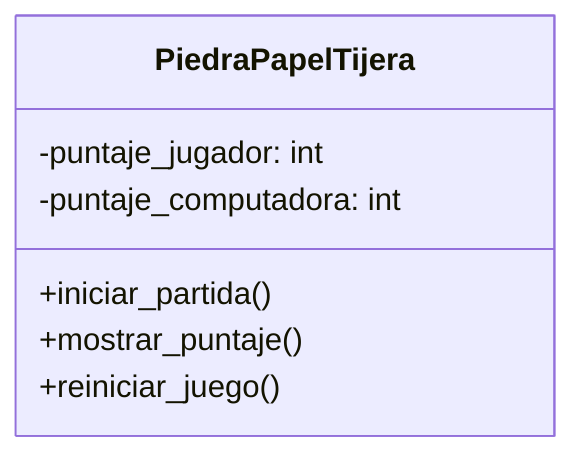

# Juego - Piedra, papel o tijera

## Análisis

### Requisitos
- El juego permite que un jugador compita contra la computadora.
- La computadora elige aleatoriamente entre:
  - Piedra
  - Papel
  - Tijera
- El juego debe registrar las victorias del jugador y de la computadora.
- El puntaje se mantiene en una única instancia del juego, por lo que es bueno aplicar Singleton.
- El juego debe incluir: 
  - El inicio de la partida
  - Mostrar puntaje del jugador y la computadora.
  - Reinicio del juego, los puntajes vuelven a 0.

- Debe existir un menú interactivo con las opciones:
  1. Iniciar una nueva partida
  2. Mostrar puntajes
  3. Reiniciar el juego
  4. Salir

### Objetos
- PiedraPapelTijera

### Características
- PiedraPapelTijera
  - puntaje_jugador: int
  - puntaje_computadora: int

### Acciones
- PiedraPapelTijera
  - iniciar_partida()
  - mostrar_puntaje()
  - reiniciar_juego()

## Diseño

Clase:
- PiedraPapelTijera:
  - Atributos:
    - puntaje_jugador
    - puntaje_computadora
  - Métodos:
    - iniciar_partida()
    - mostrar_puntaje()
    - reiniciar_juego()

