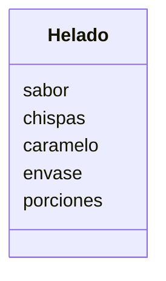

# Helado

## Análisis

**Descripción:**
Una heladería ofrece helados
Los clientes eligen entre helado de vainilla o fresa
Pueden agregar chispas de chocolate y caramelo líquido como extra
Puede llevarse en barquillo o vaso y tener hasta 3 bolitas.

### Requisitos:
- Helado de vainilla o fresa
- Agregar chispas de chocolate
- Agregar caramelo líquido
- Envase en barquillo o vaso
- Llevar hasta tres porciones

### Objetos:
- Helado

### Características:
- Helado:
    - Sabor (vainilla o fresa)
    - Chispas
    - Caramelo
    - Envase
    - Porciones

### Acciones:
    (Ninguna acción)

## Diseño

