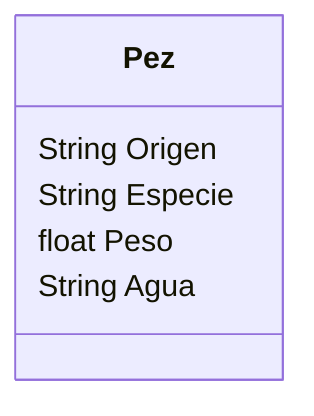

# Acuario

Un acuario quiere llevar un registro de los peces que tiene.
Necesitan registrar la especie, peso y origen.
Los peces pueden ser de agua dulce o salada.
Todos los peces son criados en cautiverio.
Antes de liberarlos se actualiza su peso y luego son liberados.

## Análisis

### Requisitos

- Registro de peces
- Registrar atributos de los peces
- Actualizar su peso antes de liberarlos
- Liberar los peces

### Objetos

Pez

### Características

- Pez:
    - Origen
    - Especie
    - Peso
    - Agua 

### Acciones

(No hay acciones)

## Diseño

