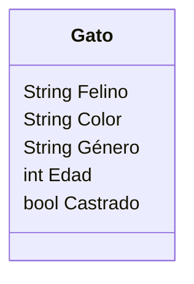

# Michi

**Descripción:**
Un coleccionista de gatos los recolecta según sus
características. Las características que mas le importan
son el color, género, edad y si están castrados o no. 
El coleccionista registra los datos de cada gato 
que encuentra.

## Análisis

### Requisitos:
- El gato tiene color, género, edad (datos).
- Si están castrados o no.
- Registro de los datos del gato.
- Todos los gatos son felinos

### Objetos:
- Gato

### Características:
- Gato:
    - Especie
    - Color
    - Género
    - Edad
    - Castrado

### Acciones:
- No hay acciones

## Diseño

