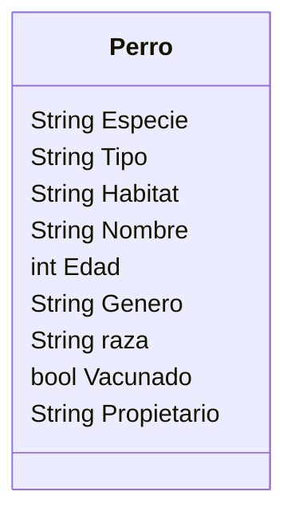

# Análisis

## Requisitos:

- Registrar perros
- Registrar los atributos de cada perro.
- Tiene vacuna el perro.

## Objetos:

- Perro

## Características:
- Perro:
    - Especie
    - Tipo
    - Habitat
    - Nombre
    - Edad
    - Género
    - Raza
    - Vacuna
    - Propietario.

## Acciones:
(No hay acciones)

# Diseño

