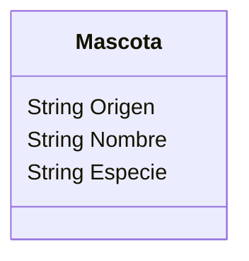

# Refugio

**Descripción:**
Un refugio de mascotas quiere registrar a los perros y gatos
que ingresan al refugio.
De cada mascota necesitan registrar el nombre, especie y origen.
Todas las mascotas tienen como origen "abandonado", este valor 
cambia a "rescatado" despues de un tiempo.

## Análisis

### Requisitos:
- Registro de perros y gatos que entran al refugio.
- Registrar nombre, especie y origen
- Las mascotas tienen un origen "abandonado" y cambiar a "rescatado" después de un tiempo.

### Objetos:
- Mascota

### Características:
- Mascota
    - Origen
    - Nombre
    - Especie

### Acciones:
(No hay acciones)

## Diseño

