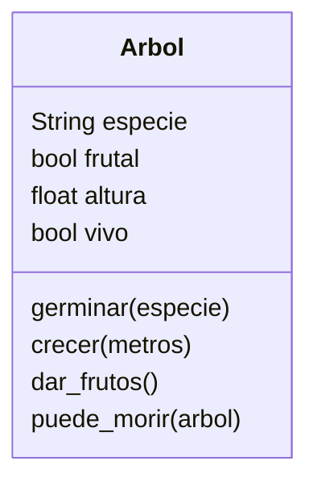

# Bosque

**Descripción:**
En la simulación de un bosque los arboles pueden crecer
tienen una especie y pueden ser frutales o no.
Nacen desde una semilla, y crecen con el tiempo
Cuando llegan a 10 metros de altura pueden dar frutos
Todos los arboles cuando tiene más de 15 metros mueren.

## Análisis

### Requisitos
- Sus atributos del árbol son especie y si son frutales.
- Nacen de una semilla
- Crecen con el tiempo
- Si llegan 10 metros de altura pueden dar frutos
- Si llegan 15 metros mueren

### Objetos
- Árbol

### Características
- Árbol
    - Especie
    - Frutal
    - Altura
    - Vivo

### Acciones
- Árbol
    - Nacer
    - Crecer
    - Dar frutos
    - Morir

## Diseño

