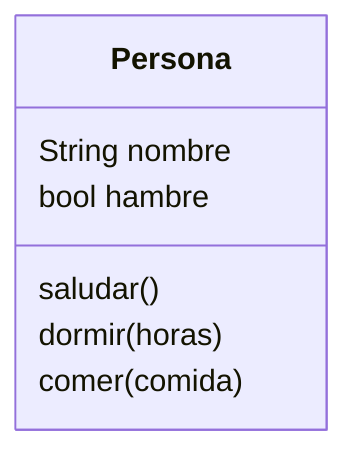
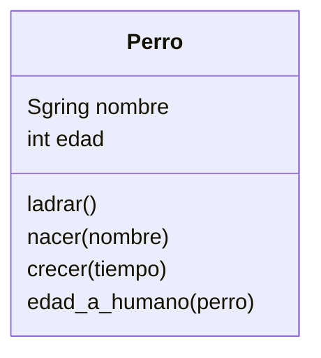
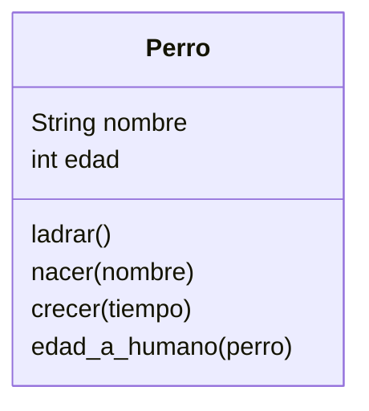
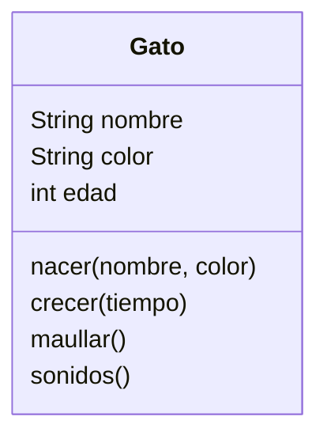

# Pylife (similar al juego sims)

Las personas creadas tienen un nombre y pueden saludar diciendo su nombre.
Ahora las personas pueden dormir una cantidad de horas.
En el juego ahora las personas pueden
tener hambre y comer para saciarla
Cuando duerme la persona despierta con hambre.

En el juego `PyLife` diseñaremos ahora perros que pueden ladrar
Todos los perros tienen un nombre y empiezan como cachorros
La diferencia entre un perro y un humano en edad es de 7 años
y los perros pueden crecer con el tiempo.

En el juego `PyLife` diseñamos gatos que pueden maullar
Todos los gatos tienen un nombre y color, nacen como cachorros
los sonidos más comunes de los gatos son `miau` y `ronroneo`

# Parte 1:

## Análisis

Requisitos:
- Crear personas
- Las personas tienen un nombre
- Las personas pueden saludar
- Las personas pueden dormir
- Las personas pueden comer
- Al despertar tienen hambre

Objetos:
- Persona

Características:
- Persona:
    - Nombre
    - Hambre

Acciones:
- Persona: 
    - Saludar
    - Dormir
    - Comer

## Diagrama de clases

---

Diseñaremos ahora perros que pueden ladrar
Todos los perros tienen un nombre y empiezan como cachorros
La diferencia entre un perro y un humano en edad es de 7 años
y los perros pueden crecer con el tiempo

## Análisis

### Requisitos

- Crear un perro
- Los perros tienen nombre
- Los perros pueden ladrar
- Los perros nacen como cachorros
- Los años de los perros se multiplican por 7

### Objetos

- Perro

### Características

- Perro: nombre, edad

### Acciones

- Perro: ladrar, nacer, crecer, edad_a_humano

## Diseño - Diagrama de clases

# Parte 2

## Análisis

### Requisitos
- Crear perro
- Los perros tienen un nombre
- Los perros pueden ladrar
- Los perros nacen como cachorros
- La edad del perros es 7 veces a la de un humano

### Objetos
- Perro

### Características
- Perro
    - Nombre
    - edad

### Acciones
- Perro
    - Ladrar
    - Nacer
    - Crecer
    - Edad a humano

## Diseño

# Parte 3

## Análisis

### Requisitos:
- Crear gato
- Gato puede maullar
- Gato tiene nombre, color
- Nacen como cachorro
- Hacen sonidos miau y ronroneo
- Pueden crecer con el tiempo

### Objetos
- Gato

### Características:
- Gato
    - nombre
    - color
    - edad

### Acciones
- Gato
    - Nacer
    - Crecer
    - Maullar
    - Hacer sonidos
## Diseño

