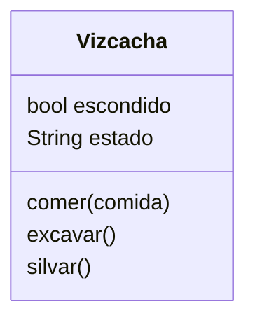

# Vizcacha

Creas un juego de rol donde eres una vizcacha
Puedes comer sólo zanahorias
Puedes excavar agujeros para esconderte cuando te asustas
Silvar `iiih iiih` te hace feliz

## Análisis

- Crear una vizcacha
- Come solo zanahorias
- Cuando excava un agujero se esconde y  está asustado
- Silva `iiih iiih` y le hace feliz

### Objetos

- Vizcacha

### Características

- Vizcacha: hambre, escondido, estado

### Acciones

- Vizcacha: comer, excavar, silvar

### Diseño - Diagrama de clases

